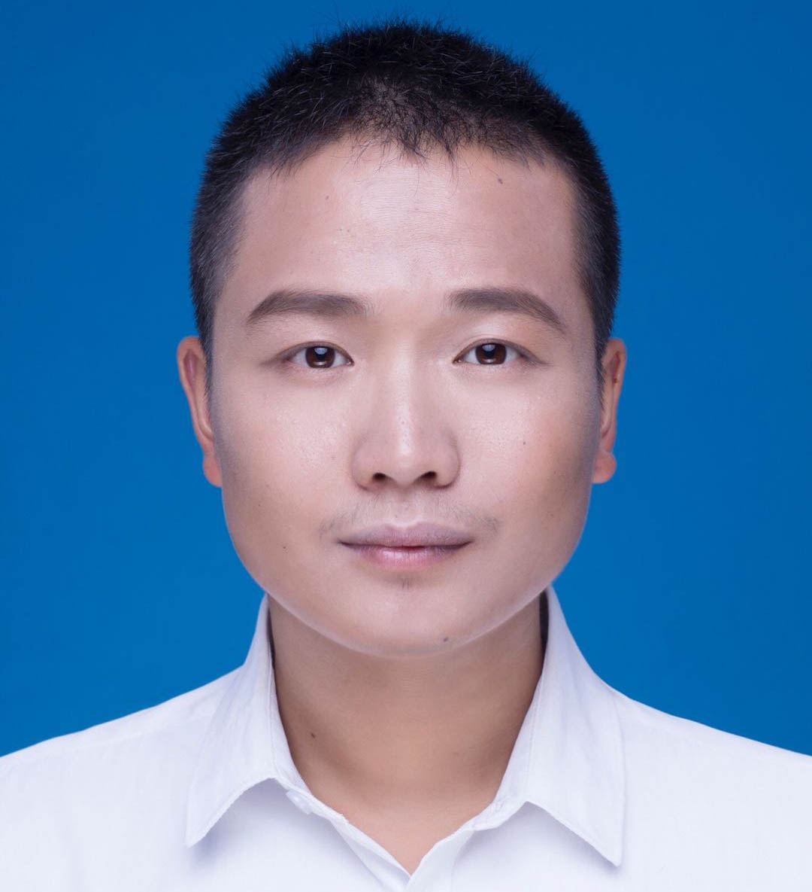

### PhD Candidate

Department of Intelligent Science,  
Graduate School of Informatics,  
Nagoya University

**Email**: zznotics at gmail dot com

### Biography

My name is Zhou Zheng, and I am going to be a first year (2020-) Ph.D. student at the Department of Intelligent Science, Graduate School of Informatics, [Nagoya University](http://www.nagoya-u.ac.jp/), supervised by Prof. [Kensaku Mori](http://www.newves.org/wiki/).

I received the Master degree from [Zhejiang University](http://www.zju.edu.cn/english/), and my thesis is about research of the segmentation method for liver and liver tumor in CT images based on a unified level set framework. After graduation, I had several industry experiences，like the role as a software and algorithm engineer in [Huawei Technologies Co., Ltd](https://en.wikipedia.org/wiki/Huawei).

My research interest is about medical image analysis. I was obsessed with the application of level set algorithm in medical image analysis, now I am dedicated to designing efficient machine learning methods for medical image analysis, especially unsupervised models.

### Publications

1. **A Unified Level Set Framework Combining Hybrid Algorithms for Liver and Liver tumor Segmentation in CT Images.**<a href="demo.html" target="_blank" title="click here to see the demo!">\[demo\]</a>  
   **Zhou Zheng**, Xuechang Zhang, Huafei Xu, Wang Liang, Siming Zheng and Yueding Shi  
   *Biomed Research International, 2018.*
2. **Liver Segmentation in CT Images Based on Region-growing and Unified Level Set Method.**  
   **Zhou Zheng**, Xuechang Zhang, Siming Zheng, Huafei Xu and Yueding Shi  
  *Journal of Zhejiang University (Engineering Science), 2018.*
3. **Semi-automatic Liver Segmentation in CT Images Through Intensity Separation and Region Growing.**  
   **Zhou Zheng**, Xuechang Zhang, Siming Zheng, Huafei Xu and Yueding Shi  
   *Procedia Computer Science, 2018.*

### Awards
* Award of Excellent Postgraduate Students of Zhejiang University, 2019
* Academic Scholarship of Zhejiang University, 2016 - 2019
* Award of Merit/Triple A for Graduate of Zhejiang University, 2017 - 2018
* Award of Honor for Graduate of Zhejiang University, 2017 - 2018
