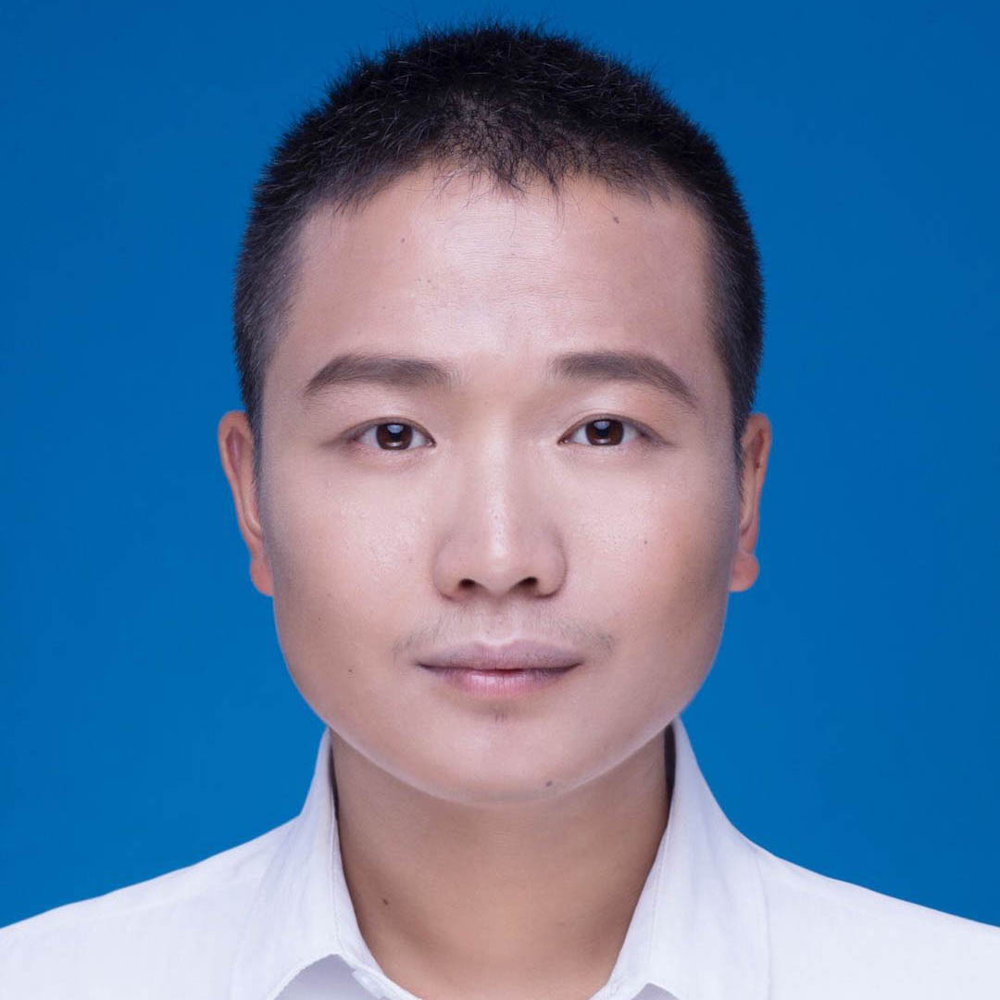

## Biography

My name is Zhou Zheng, and I am going to be a first year (2020-) Ph.D. student at the Department of Intelligent Science, Graduate School of Informatics, Nagoya University, supervised by Prof. [Kensaku Mori](http://www.newves.org/wiki/).

I received the Master degree from Institute of Mechanical Engineering in Zhejiang University in March 2019, and my thesis is about research of the segmentation method for liver and liver tumor in CT images based on a unified level set framework. After that, I worked as a software and algorithm engineer in [Huawei Technologies Co., Ltd](https://en.wikipedia.org/wiki/Huawei).

My research interest is about medical image analysis. I was obsessed with the application of level set algorithm in medical image analysis, now I am dedicated to designing efficient machine learning methods for medical image analysis, especially unsupervised models.

## Publications

* A unified level set framework combining hybrid algorithms for liver and liver tumor segmentation in CT images.
    **Zhou Zheng**, Xuechang Zhang, Huafei Xu, Wang Liang, Siming Zheng and Yueding Shi  
    *Biomed Research International, 2018.*
* Liver segmentation in CT images based on region-growing and unified level set method.
    **Zhou Zheng**, Xuechang Zhang, Siming Zheng, Huafei Xu and Yueding Shi  
    *Journal of Zhejiang University (Engineering Science), 2018.*
* Semi-automatic Liver Segmentation in CT Images Through Intensity Separation and Region Growing.
    **Zhou Zheng**, Xuechang Zhang, Siming Zheng, Huafei Xu and Yueding Shi  
    *Procedia Computer Science, 2018.*

## Awards
* Award of Excellent postgraduate students of Zhejiang University, 2019
* Academic Scholarship of Zhejiang University, 2016 - 2019
* Award of Merit/Triple A for graduate of Zhejiang University, 2017 - 2018
* Award of Honor for graduate of Zhejiang University, 2017 - 2018
